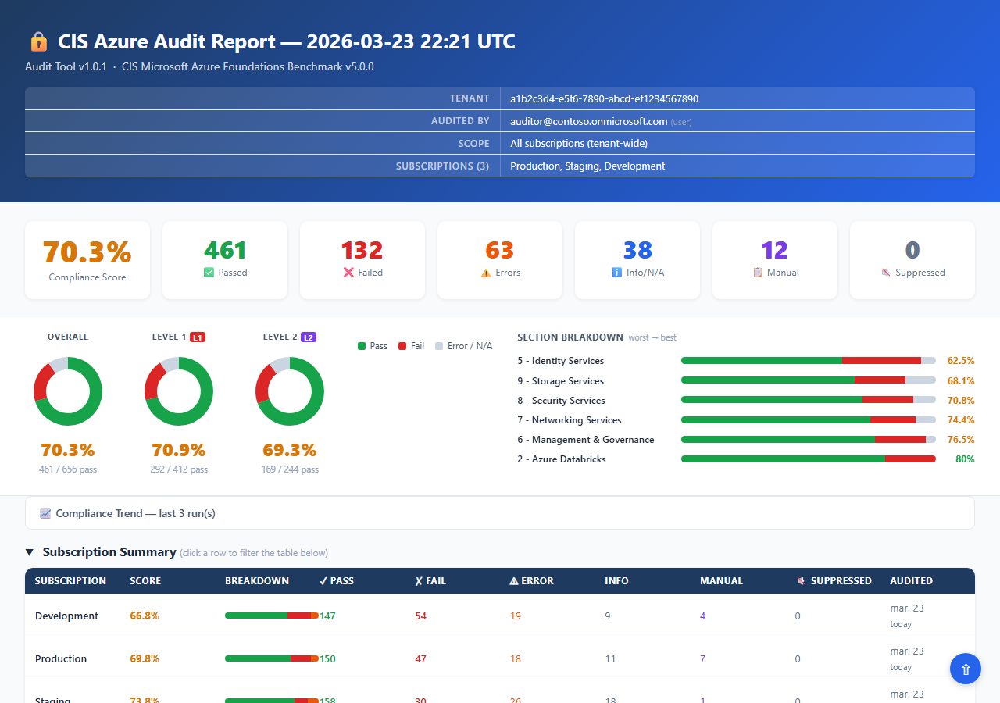

# CIS Microsoft Azure Foundations Benchmark v6.0.0 — Audit Tool (PowerShell)

[](LICENSE)
[](https://www.cisecurity.org/benchmark/azure)
[](https://learn.microsoft.com/en-us/powershell/)
[](https://github.com/vegazbabz/CISAzureBenchmark-PS/actions/workflows/ci.yml)

> **[📊 View sample report](https://htmlpreview.github.io/?https://raw.githubusercontent.com/vegazbabz/CISAzureBenchmark-PS/main/docs/sample_report.html)** — synthetic data, no real tenant information.



**Version:** 2.1.0
**Benchmark:** [CIS Microsoft Azure Foundations Benchmark v6.0.0](https://www.cisecurity.org/benchmark/azure) (April 2026)
**Coverage:** 93 automated controls across 7 sections · 34 manual controls noted in output (127 total)

---

## Overview

A PowerShell tool that audits an Azure tenant against the **[CIS Microsoft Azure Foundations Benchmark v6.0.0](https://www.cisecurity.org/benchmark/azure)** — the industry-standard hardening guide for Azure environments, published by the [Center for Internet Security (CIS)](https://www.cisecurity.org/).

All audit checks use the Az PowerShell module — no Azure CLI required.
The optional permission preflight uses `Get-AzRoleAssignment` in parallel runspaces to verify
the runner account holds the required roles before the audit begins.
Skip it with `-NoPermissionCheck` if you already know your permissions are correct.
Install the required Az modules once, then run `Connect-AzAccount` to authenticate.

Results are saved as checkpoints after each subscription completes, so a failed or interrupted run
can be resumed without re-running completed work. Output is a self-contained HTML report with
filtering, compliance scoring, charts, and per-finding remediation guidance.

---

## Requirements

### Runtime

| Requirement | Details |
| --- | --- |
| PowerShell | [7.0 or higher](https://learn.microsoft.com/en-us/powershell/scripting/install/installing-powershell) |
| Az.Accounts | `Install-Module Az.Accounts` — authentication, context, REST calls |
| Az.ResourceGraph | `Install-Module Az.ResourceGraph` — resource prefetch queries |
| Az.Monitor | `Install-Module Az.Monitor` — log profiles, diagnostic settings, activity log alerts |
| Az.Network | `Install-Module Az.Network` — network watcher flow logs |
| Az.Storage | `Install-Module Az.Storage` — storage account enumeration |
| Az.KeyVault | `Install-Module Az.KeyVault` — key rotation policies |
| Az.Resources | `Install-Module Az.Resources` — role definitions |
| Azure login | `Connect-AzAccount` completed before running |

> **Install Az modules all at once:**
>
> ```powershell
> Install-Module Az.Accounts, Az.ResourceGraph, Az.Monitor, Az.Network, Az.Storage, Az.KeyVault, Az.Resources, Az.Security -Scope CurrentUser
> ```

### Azure permissions

| Scope | Role | Purpose |
| --- | --- | --- |
| Each subscription | Reader | Enumerate all resources |
| Each subscription | Security Reader | Defender plans, security contacts |
| Microsoft Entra ID (tenant) | Global Reader | Identity checks (5.x) |
| Key Vaults (optional) | Key Vault Reader | List keys, secrets, certificates for 8.3.x checks |

> **Key Vault data plane:** Controls 8.3.1–8.3.4, 8.3.9, and 8.3.11 enumerate individual keys,
> secrets, and certificates. This requires data plane access in addition to Reader.
> For RBAC-enabled vaults assign **Key Vault Reader**; for access-policy vaults, add the
> runner account to the vault's access policy. The permission preflight probes each vault and
> warns upfront which ones are inaccessible; affected checks still return ERROR with a
> clear explanation and remediation hint in the report — compliance is unknown, not assumed clean.

---

## Quick Start

```powershell
# 1. Install required Az PowerShell modules (one-time)
Install-Module Az.Accounts, Az.ResourceGraph, Az.Monitor, Az.Network, Az.Storage, Az.KeyVault, Az.Resources, Az.Security -Scope CurrentUser

# 2. Log in to Azure
Connect-AzAccount

# 3. Run the audit (audits all enabled subscriptions in your tenant)
.\Invoke-CISAzureAudit.ps1 -TenantId (Get-AzContext).Tenant.Id
```

The report opens automatically in your browser when the audit finishes. The script will
enumerate all enabled subscriptions in the tenant, run all checks, and save the report.
(An explicit `-TenantId` or `-Subscriptions` scope is required — the tool never assumes one.)

### Use as a PowerShell module

The tool is also a proper module — import it and work with the returned summary object
instead of parsing console output:

```powershell
Import-Module .\CISAzureBenchmark.psd1

$audit = Invoke-CISAzureAudit -TenantId (Get-AzContext).Tenant.Id -NoOpen

$audit.Score          # e.g. 62.1
$audit.Counts.FAIL    # failed control count
$audit.Results        # every per-resource result object
$audit.ReportPath     # path to the generated HTML report
$audit.ExitCode       # 0 | 1 (setup error) | 2 (failures found, with -ExitCode)
```

The `.\Invoke-CISAzureAudit.ps1` script remains a thin shim around this function, so
existing command lines and CI pipelines keep working unchanged.

---

## Getting Started (step-by-step)

New to PowerShell or Azure? Follow these steps to get the tool running on your machine.

### Step 1 — Install PowerShell 7+

1. Go to [https://learn.microsoft.com/en-us/powershell/scripting/install/installing-powershell](https://learn.microsoft.com/en-us/powershell/scripting/install/installing-powershell) and follow the instructions for your OS.
2. Verify the installation:

   ```powershell
   pwsh --version
   ```

### Step 2 — Install the required Az PowerShell modules

Run this once in a PowerShell 7 terminal:

```powershell
Install-Module Az.Accounts, Az.ResourceGraph, Az.Monitor, Az.Network, Az.Storage, Az.KeyVault, Az.Resources, Az.Security -Scope CurrentUser
```

If prompted to install from an untrusted repository, type `Y` and press Enter.

### Step 3 — Get the tool

**Option A — Clone with Git** (recommended — makes updating easy):

```powershell
git clone https://github.com/vegazbabz/CISAzureBenchmark-PS.git
cd CISAzureBenchmark-PS
```

**Option B — Download as ZIP** (no Git required):

1. On the [GitHub repository page](https://github.com/vegazbabz/CISAzureBenchmark-PS),
   click the green **Code** button → **Download ZIP**.
2. Extract the ZIP and open a terminal in the extracted folder.

### Step 4 — Log in to Azure

```powershell
Connect-AzAccount
```

A browser window will open for you to sign in. The account you use needs at minimum **Reader**
and **Security Reader** on the subscriptions you want to audit.

### Step 5 — Run the audit

```powershell
.\Invoke-CISAzureAudit.ps1
```

The tool will enumerate all your enabled subscriptions, run all checks, and open the HTML report
in your browser automatically when done.

> **Tip:** To audit specific subscriptions, use the `-Subscriptions` parameter:
>
> ```powershell
> .\Invoke-CISAzureAudit.ps1 -Subscriptions "subscription-id-1","subscription-id-2"
> ```

---

## Project Structure

```text
CISAzureBenchmark.psd1       Module manifest (version, exports, Gallery metadata)
CISAzureBenchmark.psm1       Module loader — dot-sources Private/, Checks/, Public/
Invoke-CISAzureAudit.ps1     Script entry point (thin shim around the module function)
Public/
  Invoke-CISAzureAudit.ps1    The audit orchestrator — the module's exported command
Private/
  AzureClient.ps1             PS-based API client: Resource Graph (Search-AzGraph)
                              and ARM REST (Invoke-AzRestMethod)
  CheckHelpers.ps1            Prefetch data lookups, error formatting,
                              New-ErrorResult / New-InfoResult / New-ManualResult
  Checkpoint.ps1              Save/resume audit state
  Config.ps1                  Timeouts, constants, PASS/FAIL labels
  Helpers.ps1                 Logging, utilities
  History.ps1                 Run history tracking
  Identity.ps1                Subscription enumeration, permission checks
  Models.ps1                  New-CISResult (the result object contract)
  ModuleManifest.ps1          Single source of truth for the dot-source load order
  Report.ps1                  HTML report generation
  Sarif.ps1                   SARIF 2.1.0 export for code scanning
Checks/
  Section2.ps1                Databricks checks (12 controls)
  Section3.ps1                Compute checks (1 manual control)
  Section5.ps1                Identity & access checks (15 controls)
  Section6.ps1                Logging & monitoring checks (24 controls)
  Section7.ps1                Networking checks (16 controls)
  Section8.ps1                Security services checks (38 controls)
  Section9.ps1                Storage checks (21 controls — 127 total)
Tests/
  Section*.Tests.ps1          Pester tests per benchmark section (314 tests total)
  Helpers.Tests.ps1           Pure-helper tests (factories, catalog, scoring, classifiers)
  Pipeline.Tests.ps1          Report/summary pipeline tests (SARIF, suppressions, history)
  TestHelpers.ps1             Shared bootstrap: fixtures + hermetic default mocks
  Run-Tests.ps1               Test runner
scripts/
  New-SampleReport.ps1        Generate sample report with synthetic data
docs/
  sample_report.html          Pre-generated sample report
suppressions.json.example   Suppression template with annotated examples
```

---

## Usage

```text
.\Invoke-CISAzureAudit.ps1 [options]
```

### All parameters

| Parameter | Type | Default | Description |
| --- | --- | --- | --- |
| `-Subscriptions` | string[] | all | One or more subscription names or IDs to audit |
| `-Output` | string | `cis_audit_report.html` | HTML report path |
| `-Parallel` | int | 3 | Concurrent subscription workers |
| `-Level` | 1 \| 2 \| both | both | CIS level filter |
| `-Fresh` | switch | | Clear all checkpoints and start a full re-audit |
| `-ReportOnly` | switch | | Regenerate report from existing checkpoints — no API calls |
| `-NoCheckpoint` | switch | | Disable checkpoint save |
| `-SkipTenantChecks` | switch | | Skip tenant-level checks (Section 3 and 5) |
| `-NoPermissionCheck` | switch | | Skip preflight permission check |
| `-NoOpen` | switch | | Do not auto-open the report in the browser |
| `-ExitCode` | switch | | Exit with code 2 when FAIL or ERROR results are found (for CI/CD) |
| `-SuppressionsFile` | string | `suppressions.json` | Path to the suppressions file (see *Suppressing Findings*) |
| `-CompareWith` | string | | Previous run's `<report>.json` to diff against, or `auto` to pick the newest report JSON in the output directory. Adds a "Changes vs previous run" section to the HTML report and writes `<report>.diff.json` |
| `-DebugMode` | switch | | Verbose debug logging |
| `-LogFile` | string | | Write log to file |

### Configuration file

Create a `cis_audit.json` file next to the script to set persistent defaults. CLI arguments always
override config file values. Set the `CIS_AUDIT_CONFIG` environment variable to use a custom path.

See [`cis_audit.json.example`](cis_audit.json.example) for all available settings.

```json
{
    "audit": {
        "parallel": 3,
        "level": "both",
        "exit_code": true,
        "no_open": true
    },
    "timeouts": {
        "default": 60,
        "storage_list": 90
    }
}
```

### Examples

```powershell
# Audit all subscriptions
.\Invoke-CISAzureAudit.ps1

# Audit specific subscriptions with parallelism
.\Invoke-CISAzureAudit.ps1 -Subscriptions "sub-id-1","sub-id-2" -Parallel 5

# Level 1 checks only, custom output path
.\Invoke-CISAzureAudit.ps1 -Level 1 -Output report.html

# Start completely fresh, ignoring previous checkpoints
.\Invoke-CISAzureAudit.ps1 -Fresh

# Regenerate the HTML report without re-running any checks
.\Invoke-CISAzureAudit.ps1 -ReportOnly

# Trace-level diagnostics written to a log file
.\Invoke-CISAzureAudit.ps1 -DebugMode -LogFile cis_audit.log

# Skip tenant-level identity checks
.\Invoke-CISAzureAudit.ps1 -SkipTenantChecks

# Interrupted run? Just re-run — it resumes automatically
.\Invoke-CISAzureAudit.ps1

# Show what findings are currently suppressed
.\Invoke-CISAzureAudit.ps1 -ReportOnly  # suppressions applied during report generation

# Diff against the previous run (regressions, improvements, new/removed results)
.\Invoke-CISAzureAudit.ps1 -CompareWith auto
```

---

## How It Works

### Data collection — three methods

#### 1. Azure Resource Graph (bulk prefetch — once per audit)

Before any per-subscription work begins, Kusto queries fetch all relevant resources across the
entire tenant in a single round trip:

- Network Security Groups and security rules
- Storage accounts and security properties
- Key Vaults — access configuration and network settings
- Virtual Networks, subnets, and NSG associations
- Application Gateways and WAF settings
- Databricks workspaces
- Bastion Hosts
- Network Watchers and resource locations
- Role assignments (Owner and User Access Administrator)
- WAF policies

#### 2. Az PowerShell module calls per subscription

For live service configurations and data Resource Graph cannot expose:

- `Get-AzSecurityPricing` — Defender plan statuses (8.1.x)
- `Get-AzActivityLogAlert` — all 11 alert checks (6.1.2.x)
- `Get-AzDiagnosticSetting` — Key Vault and App Service diagnostic logging (6.1.1.4, 6.1.1.6)
- `Get-AzLogProfile` — activity log retention via log profile (6.1.1.3)
- `Get-AzNetworkWatcherFlowLog` — flow log retention (7.5, 7.8)
- `Get-AzKeyVaultKey` / `Get-AzKeyVaultSecret` / `Get-AzKeyVaultCertificate` — expiry dates (8.3.x)
- `Get-AzKeyVaultKeyRotationPolicy` — auto rotation configuration (8.3.9)
- `Get-AzStorageBlobServiceProperty` — soft delete, versioning, logging (9.2.x)
- `Get-AzStorageFileServiceProperty` — file soft delete and SMB settings (9.1.x)
- `Get-AzStorageAccount` — storage security properties (9.3.x)
- `Get-AzResourceLock` — CanNotDelete / ReadOnly locks (9.3.9, 9.3.10)
- `Get-AzRoleDefinition` — custom admin role detection (5.4)

#### 3. ARM / Microsoft Graph REST via `Invoke-AzRestMethod`

For tenant-level identity checks and APIs not exposed by Az module cmdlets:

- `graph.microsoft.com/v1.0/policies/identitySecurityDefaultsEnforcementPolicy` — security defaults (5.1.1)
- `graph.microsoft.com/v1.0/identity/conditionalAccess/policies` — Conditional Access fallback (5.1.1)
- `graph.microsoft.com/beta/reports/authenticationMethods/userRegistrationDetails` — per-user MFA registration (5.1.3)
- `management.azure.com/.../diagnosticSettings` — subscription-level activity log routing (6.1.1.x)
- ARM REST for security contacts (8.1.12–8.1.15), WDATP integration (8.1.3.3), and attack path notifications (8.1.15)

#### 4. Permission preflight

Before the audit begins, `Get-AzRoleAssignment` is called in parallel runspaces (up to 8 at once)
to verify the runner account holds the required roles on every subscription. No Azure CLI is
required. Use `-NoPermissionCheck` to bypass the preflight entirely.

### Permission preflight

Before the audit begins, the tool checks whether the runner account holds the required roles on
every subscription.

### Checkpoints and resume

After each subscription completes, results are written to `cis_checkpoints/<subscription-id>.json`.
If the script is stopped or crashes mid-run, re-running it will skip completed subscriptions and
continue from where it left off. Use `-Fresh` to discard all checkpoints and start over.

### Parallel execution

Subscriptions run concurrently via PowerShell runspaces. The default is 3 parallel workers
(configurable via `-Parallel`). The Resource Graph prefetch always runs once before the parallel
loop begins.

Adaptive concurrency is built-in: if Azure returns throttling responses (HTTP 429), the tool
automatically reduces the number of concurrent workers. After two consecutive batches without
throttling, workers are increased back towards the original value.

---

## HTML Report

The generated report is a self-contained HTML file with no external dependencies.

- **Summary cards** — compliance score (PASS / (PASS + FAIL + ERROR) — unreadable resources count against the score; INFO, MANUAL and SUPPRESSED are excluded), plus counts for each status.
- **Compliance donuts** — three ring charts showing PASS/FAIL/ERROR proportions overall, for Level 1, and for Level 2.
- **Section breakdown** — horizontal stacked bars per CIS section, sorted worst to best.
- **Per-subscription summary** — stacked-bar table showing pass/fail/error counts per subscription; click a row to filter the results table to that subscription.
- **Filterable table** — filter simultaneously by free-text search, subscription, status, and level (L1/L2). Section headers collapse when all their results are filtered out.
- **Per-resource results** — each NSG, storage account, Key Vault, subnet, and Databricks workspace is reported individually, not aggregated to a single pass/fail per control.
- **Remediation hints** — every FAIL result includes the Azure portal navigation path to fix the issue. ERROR results include an actionable explanation of what access is missing.
- **Audit-error rows** — if a subscription context switch, a whole check group, or the tenant-level run crashes, a synthetic ERROR row (control `CONTEXT`, `GROUP`, `TENANT` or `FATAL` under section *0 - Audit Errors*) is emitted so the failure is visible in the report instead of controls silently disappearing.
- **Compliance trend** — after two or more full-tenant audit runs, a collapsible chart appears showing the compliance score over time.
- **Back to top** — fixed button in the bottom-right corner for long reports.

### Status types

| Status | Meaning |
| --- | --- |
| PASS | Control is compliant |
| FAIL | Control is non-compliant — remediation hint provided |
| ERROR | Check could not complete — audit gap (permissions missing, timeout, or API error). Compliance is **unknown**; do not treat as clean. |
| INFO | Not applicable — the resource type doesn't exist or the account type doesn't support the feature |
| MANUAL | Cannot be automated — requires manual verification per the CIS PDF |
| SUPPRESSED | Accepted risk — finding acknowledged with justification |

> **ERROR vs INFO distinction:**
> `ERROR` means *"the control applies, but the audit couldn't evaluate it"* — flag it for follow-up.
> `INFO` means *"the control genuinely doesn't apply here"* — for example, an ADLS Gen2 storage account
> has no blob/file service by design, so the blob checks simply don't apply. There is nothing to fix.

### `-ReportOnly`: regenerate the report without re-auditing

```powershell
.\Invoke-CISAzureAudit.ps1 -ReportOnly
```

Loads all existing checkpoints and regenerates the HTML — no Azure API calls are made.
Useful after upgrading the tool or changing the `-Level` filter.

### Output files

Every run writes four files alongside the HTML report:

| File | Format | Purpose |
| --- | --- | --- |
| `cis_audit_report.html` | HTML | Interactive visual report (auto-opened unless `-NoOpen`) |
| `cis_audit_report.json` | JSON | Machine-readable results for downstream tooling |
| `cis_audit_report.csv` | CSV | Spreadsheet-friendly format for compliance teams |
| `cis_audit_report.sarif` | SARIF 2.1.0 | Findings for GitHub code scanning / Defender for DevOps (see *CI/CD pipeline*) |

Use `-Output report.html` to change the base path — `.json`, `.csv` and `.sarif` extensions are derived automatically.

The SARIF log contains findings only: FAIL maps to `error`, ERROR to `warning` (an unauditable
control is a finding, mirroring the score), and SUPPRESSED results carry a SARIF suppression
object so code-scanning UIs show them as dismissed. PASS/INFO/MANUAL are omitted.

---

## Suppressing Findings (Accepted Risks)

Create a `suppressions.json` file in the project root to mark specific findings as accepted risks.
Suppressed findings are reclassified as **SUPPRESSED** in the report and excluded from the FAIL/ERROR counts.

A template with annotated examples is provided in [`suppressions.json.example`](suppressions.json.example)
(includes examples for WAF-fronted architectures and B2B guest admin accounts).
Copy it to `suppressions.json` and remove any entries that don't apply.

### suppressions.json format

```json
[
  {
    "control_id": "9.5",
    "justification": "Legacy storage account — migration planned for Q3",
    "expires": "2025-09-30",
    "resource": "/subscriptions/.../storageAccounts/legacy01",
    "subscription": "Production"
  }
]
```

### Suppression rules

- `control_id` (required) — CIS control ID to suppress (e.g. `"9.5"`).
- `justification` (required) — human-readable reason for the suppression.
- `expires` (required) — expiry date in `YYYY-MM-DD` format. Maximum 365 days from today.
- `resource` (optional) — resource ID to match. Omit to suppress all resources for this control.
- `subscription` (optional) — subscription name or ID. Omit to suppress across all subscriptions.

Expired entries are silently ignored. The summary banner shows active suppression count.

---

## Controls Covered

### Section 2 — Azure Databricks (6 automated · 6 manual)

| Control | Title | Level |
| --- | --- | --- |
| 2.1.1 | Databricks deployed in a customer-managed VNet | L1 |
| 2.1.2 | NSGs configured for Databricks subnets | L1 |
| 2.1.3 | Traffic encrypted between cluster worker nodes (manual) | L2 |
| 2.1.4 | Users/groups synced from Microsoft Entra ID (manual) | L1 |
| 2.1.5 | Unity Catalog configured (manual) | L1 |
| 2.1.6 | PAT usage restricted and expiry enforced (manual) | L1 |
| 2.1.7 | Diagnostic log delivery configured | L1 |
| 2.1.8 | Critical data encrypted with customer-managed keys (manual) | L2 |
| 2.1.9 | No Public IP enabled | L1 |
| 2.1.10 | Allow Public Network Access disabled | L1 |
| 2.1.11 | Private endpoints used to access workspaces | L2 |
| 2.1.12 | Databricks groups reviewed periodically (manual) | L1 |

### Section 3 — Compute Services (1 manual)

| Control | Title | Level | Notes |
| --- | --- | --- | --- |
| 3.1.1 | Only MFA-enabled identities can access privileged VMs | L2 | **Manual** — requires correlating role assignments with MFA status |

> **Sections 3 and 4** of the CIS Azure Foundations Benchmark v6.0.0 are largely reference
> sections — most Compute and Database controls have been relocated to the
> *CIS Microsoft Azure Compute Services Benchmark* and *CIS Microsoft Azure Database
> Services Benchmark* respectively. Only 3.1.1 (Virtual Machines) remains in the
> Foundations Benchmark as an auditable control.

### Section 5 — Identity Services (8 automated · 7 manual)

| Control | Title | Level | Notes |
| --- | --- | --- | --- |
| 5.1.1 | 'security defaults' enabled in Microsoft Entra ID | L1 | |
| 5.1.2 | Require MFA to register or join devices | L1 | **Manual** |
| 5.1.3 | 'multifactor authentication' enabled for all users | L1 | |
| 5.1.4 | Remember MFA on trusted devices disabled | L1 | **Manual** |
| 5.3.1 | Azure admin accounts not used for daily operations | L1 | **Manual** |
| 5.3.2 | Guest users reviewed regularly | L1 | **Manual** — passes when no guests exist; guest inventory pulled via Graph |
| 5.3.3 | Use of 'User Access Administrator' role restricted | L1 | |
| 5.3.4 | Privileged role assignments periodically reviewed | L1 | **Manual** |
| 5.3.5 | Disabled accounts have no Read/Write/Owner permissions | L1 | |
| 5.3.6 | 'Tenant Creator' role assignments periodically reviewed | L1 | **Manual** |
| 5.3.7 | Non-privileged role assignments periodically reviewed | L1 | **Manual** |
| 5.4 | No custom subscription administrator roles | L1 | |
| 5.5 | Custom role assigned for administering resource locks | L2 | |
| 5.6 | Subscription leaving/entering tenant set to 'Permit no one' | L2 | |
| 5.7 | Between 2 and 3 subscription owners | L1 | |

### Section 6 — Logging & Monitoring (15 automated · 9 manual)

| Control | Title | Level |
| --- | --- | --- |
| 6.1.1.1 | Diagnostic Setting exists for Subscription Activity Logs | L1 |
| 6.1.1.2 | Diagnostic Setting captures appropriate categories | L1 |
| 6.1.1.3 | Storage Account with activity-logs container encrypted with CMK (manual) | L2 |
| 6.1.1.4 | Logging for Azure Key Vault enabled | L1 |
| 6.1.1.5 | NSG Flow Logs captured and sent to Log Analytics (manual) | L2 |
| 6.1.1.6 | Virtual Network Flow Logs captured and sent to Log Analytics (manual) | L2 |
| 6.1.1.7 | Entra Diagnostic Setting for Microsoft Graph Activity Logs (manual) | L2 |
| 6.1.1.8 | Entra Diagnostic Setting for Microsoft Entra Activity Logs (manual) | L2 |
| 6.1.1.9 | Intune Logs captured and sent to Log Analytics (manual) | L2 |
| 6.1.2.1 | Activity Log Alert: Create Policy Assignment | L1 |
| 6.1.2.2 | Activity Log Alert: Delete Policy Assignment | L1 |
| 6.1.2.3 | Activity Log Alert: Create or Update NSG | L1 |
| 6.1.2.4 | Activity Log Alert: Delete NSG | L1 |
| 6.1.2.5 | Activity Log Alert: Create or Update Security Solution | L1 |
| 6.1.2.6 | Activity Log Alert: Delete Security Solution | L1 |
| 6.1.2.7 | Activity Log Alert: Create or Update SQL Firewall Rule | L1 |
| 6.1.2.8 | Activity Log Alert: Delete SQL Firewall Rule | L1 |
| 6.1.2.9 | Activity Log Alert: Create or Update Public IP | L1 |
| 6.1.2.10 | Activity Log Alert: Delete Public IP | L1 |
| 6.1.2.11 | Activity Log Alert: Service Health | L1 |
| 6.1.3.1 | Application Insights configured | L2 |
| 6.1.4 | Azure Monitor resource logging enabled for all supported services (manual) | L1 |
| 6.1.5 | Basic/Free/Consumption SKUs not used on production artifacts (manual) | L2 |
| 6.2 | Resource Locks set for mission-critical resources (manual) | L2 |

### Section 7 — Networking Services (13 automated · 3 manual)

| Control | Title | Level |
| --- | --- | --- |
| 7.1 | RDP (3389) not open to internet | L1 |
| 7.2 | SSH (22) not open to internet | L1 |
| 7.3 | UDP port access from internet restricted | L1 |
| 7.4 | HTTP/HTTPS (80/443) from internet evaluated and restricted | L1 |
| 7.5 | NSG flow log retention >= 90 days | L2 |
| 7.6 | Network Watcher enabled for all regions in use | L2 |
| 7.7 | Public IP addresses evaluated periodically (manual) | L1 |
| 7.8 | VNet flow log retention >= 90 days | L2 |
| 7.9 | VPN Gateway P2S authentication type = Entra ID only (manual) | L2 |
| 7.10 | WAF enabled on Azure Application Gateway | L2 |
| 7.11 | Subnets associated with NSGs | L1 |
| 7.12 | App Gateway SSL policy min TLS 1.2+ | L1 |
| 7.13 | HTTP2 enabled on Application Gateway | L1 |
| 7.14 | WAF request body inspection enabled | L2 |
| 7.15 | WAF bot protection enabled | L2 |
| 7.16 | Network Security Perimeter used for PaaS resources (manual) | L2 |

### Section 8 — Security Services (30 automated · 8 manual)

| Control | Title | Level |
| --- | --- | --- |
| 8.1.1.1 | Microsoft Defender CSPM | L2 |
| 8.1.2.1 | Microsoft Defender for APIs | L2 |
| 8.1.3.1 | Microsoft Defender for Servers | L2 |
| 8.1.3.2 | Vulnerability assessment for machines component (manual) | L2 |
| 8.1.3.3 | Endpoint protection (WDATP) component | L2 |
| 8.1.3.4 | Agentless scanning for machines component (manual) | L2 |
| 8.1.3.5 | File Integrity Monitoring component (manual) | L2 |
| 8.1.4.1 | Microsoft Defender for Containers | L2 |
| 8.1.5.1 | Microsoft Defender for Storage | L2 |
| 8.1.5.2 | ATP alerts for storage accounts monitored (manual) | L2 |
| 8.1.6.1 | Microsoft Defender for App Services | L2 |
| 8.1.7.1 | Microsoft Defender for Azure Cosmos DB | L2 |
| 8.1.7.2 | Microsoft Defender for Open-Source Relational DBs | L2 |
| 8.1.7.3 | Microsoft Defender for SQL (Managed Instance) | L2 |
| 8.1.7.4 | Microsoft Defender for SQL Servers on Machines | L2 |
| 8.1.8.1 | Microsoft Defender for Key Vault | L2 |
| 8.1.9.1 | Microsoft Defender for Resource Manager | L2 |
| 8.1.10 | Defender configured to check VM OS updates | L1 |
| 8.1.11 | Non-deprecated MCSB policies not Disabled (manual) | L1 |
| 8.1.12 | Security alerts notify subscription Owners | L1 |
| 8.1.13 | Additional email addresses for security contact | L1 |
| 8.1.14 | Alert severity notifications configured | L1 |
| 8.1.15 | Attack path notifications configured | L1 |
| 8.1.16 | Defender External Attack Surface Monitoring (EASM) (manual) | L2 |
| 8.2.1 | Microsoft Defender for IoT Hub (manual) | L2 |
| 8.3.1 | Key expiration set — Key Vaults using RBAC | L1 |
| 8.3.2 | Key expiration set — access policies (legacy) | L1 |
| 8.3.3 | Secret expiration set — Key Vaults using RBAC | L1 |
| 8.3.4 | Secret expiration set — access policies (legacy) | L1 |
| 8.3.5 | Key Vault purge protection enabled | L1 |
| 8.3.6 | Key Vault RBAC authorization enabled | L2 |
| 8.3.7 | Key Vault public network access disabled | L1 |
| 8.3.8 | Private endpoints used to access Key Vault | L2 |
| 8.3.9 | Automatic key rotation enabled | L2 |
| 8.3.10 | Azure Key Vault Managed HSM used when required (manual) | L2 |
| 8.3.11 | Certificate validity period <= 12 months | L1 |
| 8.4.1 | Azure Bastion Host exists | L2 |
| 8.5 | DDoS Network Protection enabled on VNets | L2 |

### Section 9 — Storage Services (21 automated)

| Control | Title | Level |
| --- | --- | --- |
| 9.1.1 | Soft delete for Azure File Shares enabled | L1 |
| 9.1.2 | SMB protocol version >= 3.1.1 | L1 |
| 9.1.3 | SMB channel encryption AES-256-GCM or higher | L1 |
| 9.2.1 | Blob soft delete enabled | L1 |
| 9.2.2 | Container soft delete enabled | L1 |
| 9.2.3 | Blob versioning enabled | L2 |
| 9.3.1.1 | Key rotation reminders enabled | L1 |
| 9.3.1.2 | Access keys regenerated within 90 days | L1 |
| 9.3.1.3 | Storage account key access disabled | L1 |
| 9.3.2.1 | Private endpoints used to access storage accounts | L2 |
| 9.3.2.2 | Public network access disabled | L1 |
| 9.3.2.3 | Default network access rule is Deny | L1 |
| 9.3.3.1 | Default to Microsoft Entra authorization in Azure portal | L1 |
| 9.3.4 | Secure transfer (HTTPS) required | L1 |
| 9.3.5 | Allow trusted Microsoft services to access storage | L2 |
| 9.3.6 | Minimum TLS version 1.2 | L1 |
| 9.3.7 | Cross-tenant replication disabled | L1 |
| 9.3.8 | Blob anonymous access disabled | L1 |
| 9.3.9 | ARM delete locks applied to storage accounts | L1 |
| 9.3.10 | ARM ReadOnly locks considered for storage accounts | L2 |
| 9.3.11 | Redundancy set to geo-redundant (GRS) | L2 |

> **9.3.9 / 9.3.10 resource locks** are marked *Manual* in the v6 benchmark, but this tool
> evaluates them automatically (via `Get-AzResourceLock`) to provide a real PASS/FAIL signal.

---

## Testing

The test suite uses **Pester 5** — all tests mock Az module calls so no real Azure connection is needed.

### Run everything

```powershell
# Requires Pester 5.0+
Install-Module Pester -Force -Scope CurrentUser

# Run all tests
.\Tests\Run-Tests.ps1
```

### Run a single check

```powershell
.\Tests\Run-Tests.ps1 -Test "5_27"
```

### With code coverage

```powershell
.\Tests\Run-Tests.ps1 -Coverage

# Fail (exit 1) when coverage drops below a floor — this is what CI enforces
.\Tests\Run-Tests.ps1 -Coverage -MinCoverage 75
```

Coverage measures `Private/*.ps1` and `Checks/*.ps1` and writes `coverage.xml`
(JaCoCo). In GitHub Actions the percentage is also published to the job summary.

### Continuous Integration

A GitHub Actions pipeline runs on every push and pull request:

- Pester tests (Ubuntu + Windows)
- Code coverage floor of 75% (Ubuntu leg, published in the job summary)
- PSScriptAnalyzer linting

The workflow file lives at `.github/workflows/ci.yml`.

#### Using this tool in your own CI/CD pipeline

Add `-ExitCode` to make the tool exit with code 2 when any FAIL or ERROR results are found.
This lets Azure DevOps, GitHub Actions, and similar systems fail the build on compliance regressions:

```yaml
# GitHub Actions example
- name: Azure foundations audit
  shell: pwsh
  run: |
    .\Invoke-CISAzureAudit.ps1 `
      -Subscriptions "Production" `
      -NoOpen `
      -ExitCode
  # Step fails (exit code 2) if any controls are non-compliant
```

```yaml
# Azure DevOps example
- task: PowerShell@2
  displayName: 'Azure Foundations audit'
  inputs:
    targetType: inline
    pwsh: true
    script: |
      .\Invoke-CISAzureAudit.ps1 -Subscriptions $(SUB_NAME) -NoOpen -ExitCode
  # Marks the pipeline stage as failed when FAIL/ERROR results are found
```

#### Uploading findings to GitHub code scanning

Every run also writes a SARIF 2.1.0 log next to the report. Upload it to surface findings
in the repository's **Security → Code scanning** tab (requires GitHub Advanced Security on
private repos; free for public repos):

```yaml
- name: Azure foundations audit
  shell: pwsh
  run: |
    .\Invoke-CISAzureAudit.ps1 `
      -Subscriptions "Production" `
      -Output reports/cis.html `
      -NoOpen
  # No -ExitCode: let the upload step run even when there are findings

- name: Upload SARIF to code scanning
  if: always()
  uses: github/codeql-action/upload-sarif@v3
  with:
    sarif_file: reports/cis.sarif
    category: cis-azure-benchmark
```

Alerts are keyed by control + subscription + resource, so a finding that persists across
runs stays a single alert, and one that disappears is closed automatically.

#### Scheduled audits with OIDC (no stored secrets)

For recurring audits, use GitHub's OIDC federation: the workflow exchanges a short-lived
GitHub token for an Azure token at run time, so no client secret or certificate is ever
stored in the repository.

One-time Azure setup — an app registration with a federated credential:

```bash
# 1. App registration + service principal
az ad app create --display-name "cis-azure-audit"        # note the appId in the output
az ad sp create --id <appId>

# 2. Trust GitHub's OIDC issuer for this repository's default branch
#    (scheduled workflows always run on the default branch, so the subject must match it)
az ad app federated-credential create --id <appId> --parameters '{
  "name": "github-scheduled-audit",
  "issuer": "https://token.actions.githubusercontent.com",
  "subject": "repo:<owner>/<repo>:ref:refs/heads/main",
  "audiences": ["api://AzureADTokenExchange"]
}'

# 3. Grant read access on each subscription to audit
az role assignment create --assignee <appId> --role "Reader" --scope /subscriptions/<subId>
az role assignment create --assignee <appId> --role "Security Reader" --scope /subscriptions/<subId>
```

For the identity checks (section 5.x, Microsoft Graph) also assign the service principal
the **Global Reader** Entra role; without it those controls return ERROR with the missing
permission named — compliance is unknown, not assumed clean.

Store `AZURE_CLIENT_ID` (the appId), `AZURE_TENANT_ID` and `AZURE_SUBSCRIPTION_ID` as
repository **variables** (Settings → Secrets and variables → Actions → Variables) — none
of them is a secret.

Then the workflow:

```yaml
name: Weekly CIS Azure audit

on:
  schedule:
    - cron: '17 6 * * 1'   # Mondays 06:17 UTC
  workflow_dispatch: {}    # allow manual runs too

permissions:
  id-token: write   # required for the OIDC token exchange
  contents: read

jobs:
  audit:
    runs-on: ubuntu-latest
    steps:
      - name: Check out the audit tool
        uses: actions/checkout@v4
        with:
          repository: vegazbabz/CISAzureBenchmark-PS   # omit if this workflow lives in the tool repo

      - name: Install Az modules
        shell: pwsh
        run: |
          Install-Module Az.Accounts, Az.ResourceGraph, Az.Monitor, Az.Network, `
            Az.Storage, Az.KeyVault, Az.Resources, Az.Security -Scope CurrentUser -Force

      - name: Azure login (OIDC)
        uses: azure/login@v2
        with:
          client-id: ${{ vars.AZURE_CLIENT_ID }}
          tenant-id: ${{ vars.AZURE_TENANT_ID }}
          subscription-id: ${{ vars.AZURE_SUBSCRIPTION_ID }}
          enable-AzPSSession: true   # the tool uses Az PowerShell, not az CLI

      - name: Run audit
        shell: pwsh
        run: |
          ./Invoke-CISAzureAudit.ps1 `
            -Subscriptions "${{ vars.AZURE_SUBSCRIPTION_ID }}" `
            -Output reports/cis.html `
            -NoOpen `
            -ExitCode

      - name: Upload report artifacts
        if: always()   # keep the reports even when -ExitCode fails the job
        uses: actions/upload-artifact@v4
        with:
          name: cis-audit-report
          path: reports/
```

The artifact contains all four report files (`cis.html`, `cis.json`, `cis.csv`,
`cis.sarif`). To also surface findings in the Security tab, append the
`upload-sarif` step from the previous section (add `security-events: write` to the
workflow's `permissions` block).

> **Note:** GitHub disables scheduled workflows in repositories with no activity for
> 60 days — a manual `workflow_dispatch` run re-enables them.

Exit code summary:

| Code | Meaning |
| --- | --- |
| `0` | Audit completed — all controls passed (or all failures are suppressed) |
| `1` | Tool setup error — Az PowerShell module missing, not logged in to Azure, or no accessible subscriptions found |
| `2` | Compliance failure — one or more FAIL or ERROR results detected (only with `-ExitCode`) |

---

## Checkpoint Files

```text
cis_checkpoints/
  |- xxxxxxxx-xxxx-xxxx-xxxx-xxxxxxxxxxxx.json   <- completed
  |- yyyyyyyy-yyyy-yyyy-yyyy-yyyyyyyyyyyy.json   <- completed
  `- zzzzzzzz-zzzz-zzzz-zzzz-zzzzzzzzzzzz.json  <- failed (retried on next run)
```

Each file contains the full result set for that subscription, a UTC timestamp, and a completion
status. Delete the `cis_checkpoints/` folder or use `-Fresh` to discard all checkpoints.
Use `-ReportOnly` to regenerate the HTML report from existing checkpoints without running any checks.

---

## Known Limitations

**Read-only** — the script audits only. It makes no changes to your environment.

**Point-in-time** — results reflect the state at the moment the script ran.

**Key Vault data plane access** — listing keys, secrets, and certificates requires data plane
permissions in addition to subscription Reader. Assign **Key Vault Reader** (RBAC vaults) or add
the runner account to the vault's access policy (non-RBAC vaults). Without this, affected checks
return ERROR with an explanatory message. The report clearly distinguishes this from a clean
result — compliance is unknown, not assumed clean.

**Graph API for identity checks** — controls 5.1.1, 5.1.3, 5.3.2 and 5.3.5 call the Microsoft Graph
API via `Invoke-AzRestMethod`. If the required Graph permissions have not been consented for the
identity running the audit, these will return ERROR. Control 5.6 reads the tenant-level
subscription policy via ARM and returns ERROR when the caller lacks tenant-scope read access.
Test with:

```powershell
Invoke-AzRestMethod -Method GET -Uri "https://graph.microsoft.com/v1.0/policies/identitySecurityDefaultsEnforcementPolicy"
```

---

## Troubleshooting

**Identity checks return ERROR (AccessDenied)**
Your account needs Global Reader in Entra ID. To verify Graph API access:

```powershell
Invoke-AzRestMethod -Method GET -Uri "https://graph.microsoft.com/v1.0/policies/authorizationPolicy"
```

If this returns a 403, ask your Entra ID admin to grant Global Reader or consent to the required
Graph API permissions for the service principal used for auditing.

**Key Vault checks return ERROR (audit incomplete)**
The runner account needs Key Vault data plane access. For RBAC-enabled vaults assign the
**Key Vault Reader** role; for access-policy vaults, add the account to the vault's access policy.
The ERROR message in the report states exactly what is missing.

**Subscription not found**
Values passed to `-Subscriptions` must match an existing subscription name or ID exactly.
Run `Get-AzSubscription | Select-Object Name, Id` to see the available subscriptions.

**Interrupted run**
Re-run the same command to resume from where it stopped, or add `-Fresh` to start over.

---

## Disclaimer

This tool is provided **as-is, with no warranty of any kind**. The maintainers and contributors
offer no SLA, make no guarantee of accuracy or completeness, and accept no legal responsibility
or liability for the use of this tool or any decisions made based on its output. Use is entirely
at your own risk. See [LICENSE](LICENSE) for the full MIT disclaimer.

## Attribution

This is an independent community implementation referencing the publicly available
**[CIS Microsoft Azure Foundations Benchmark v6.0.0](https://www.cisecurity.org/benchmark/azure)**.
CIS Benchmarks are the property of the Center for Internet Security (<https://www.cisecurity.org>),
used under [CC BY-NC-SA 4.0](https://creativecommons.org/licenses/by-nc-sa/4.0/).
This tool is not affiliated with, endorsed by, or approved by CIS.

## License

[MIT](LICENSE)

**Version:** 2.1.0
**Benchmark:** CIS Microsoft Azure Foundations Benchmark v6.0.0 (April 2026)
**Coverage:** 93 automated controls across 7 sections · 34 manual controls noted in output (127 total)
